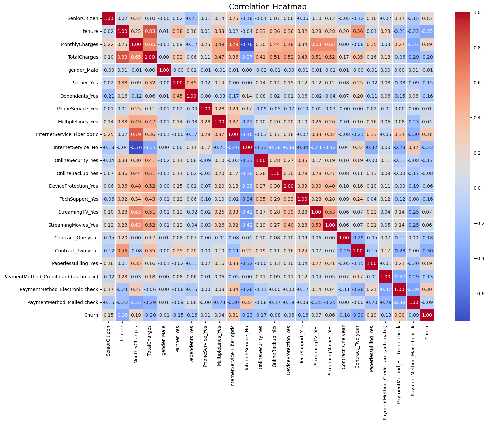
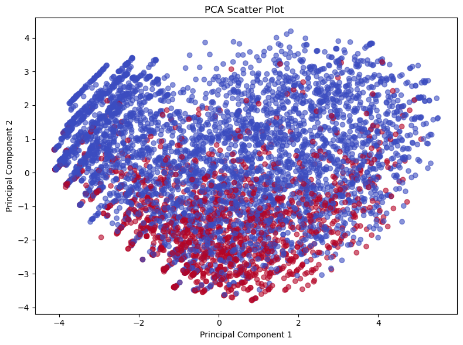
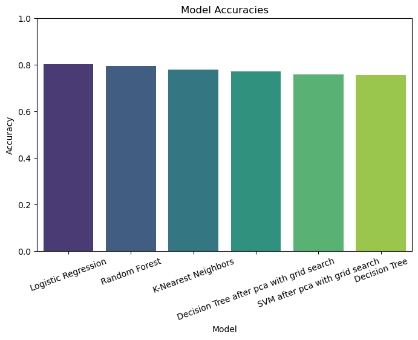

📉 Telco Customer Churn Prediction

A machine learning project that predicts whether a telecom customer will churn (leave) or stay, using 5 classification algorithms with a full preprocessing, balancing, and hyperparameter tuning pipeline.

---

🧠 Problem Statement

Customer churn is a critical business problem in the telecom industry. This project builds and compares multiple ML models to predict churn early, enabling proactive retention strategies.

---

📊 Dataset

- **Source:** Telco Customer Churn Dataset
- **Type:** Binary Classification (Churn: Yes / No)
- **Features:** Customer demographics, account info, and service usage

---


| Step | Details |
|------|---------|
| Data Cleaning | Handled missing values, removed duplicates, dropped irrelevant columns |
| Encoding | One-Hot Encoding for categorical features, Label Encoding for target |
| EDA | Pie charts, histograms, boxplots, correlation heatmap |
| Scaling | StandardScaler |
| Resampling | SMOTE for class imbalance |
| Dimensionality Reduction | PCA (95% variance retained) |
| Tuning | GridSearchCV for Random Forest, SVM, Decision Tree |

---

🤖 Models Used

| Model | Tuned | Accuracy |
|-------|-------|----------|
| Logistic Regression | ✅ (with SMOTE) | 80.3% |
| Random Forest | ✅ (GridSearchCV) | 79.6% |
| Support Vector Machine | ✅ (PCA + GridSearchCV) | 76.0% |
| K-Nearest Neighbors | ❌ | 77.9% |
| Decision Tree | ✅ (PCA + GridSearchCV) | 77.3% |

> 🏆 **Best Model Accuracy: Logistic Regression (80.3%)**
---

🖼️ Screenshots

Correlation Heatmap


PCA Scatter Plot


Models Accuracy Comparison


Dashboard


---

🛠️ Tech Stack


---

📁 Project Structure

```
telco-customer-churn-prediction/
│
├── data/
│   └── telco_churn.csv
├── notebooks/
│   └── churn_prediction.ipynb
├── screenshots/
│   ├── heatmap.png
│   ├── pca_plot.png
│   └── model_comparison.png
└── README.md
```

---

🚀 How to Run

```bash
git clone https://github.com/v7med7elmy-ai/telco-customer-churn-prediction.git
cd telco-customer-churn-prediction
pip install -r requirements.txt
jupyter notebook notebooks/churn_prediction.ipynb
```

---

👤 Author

**Ahmed Helmy** — AI Engineering Student
[GitHub](https://github.com/v7med7elmy-ai)
